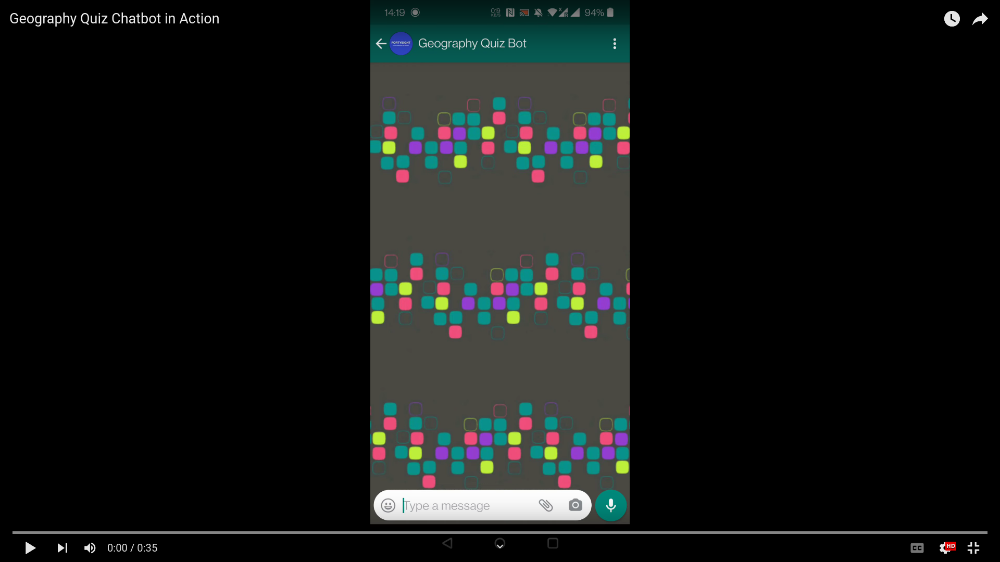

# :globe_with_meridians: Geography Quiz Chatbot

## Synopsis

*Geography Quiz Chatbot* is a chatbot where users can play _Guess the capital_ (given a country the user must select the correct capital from a range of choices) or _Guess the country_ (given the outlines of a country the user must select the correct country from a range of choices). The questions will be delivered and checked by Python Lambdas. The following short screen recording shows an interaction with the chatbot via WhatsApp.

## Tech Stack

...

## Structure

...

## Usage & Development

...

## Deployment & Hosting

...